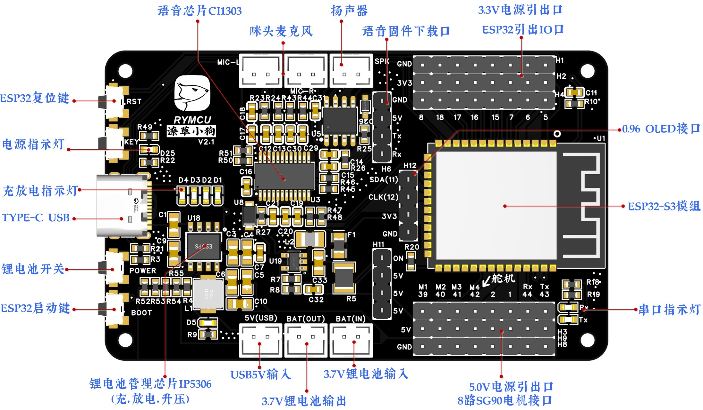
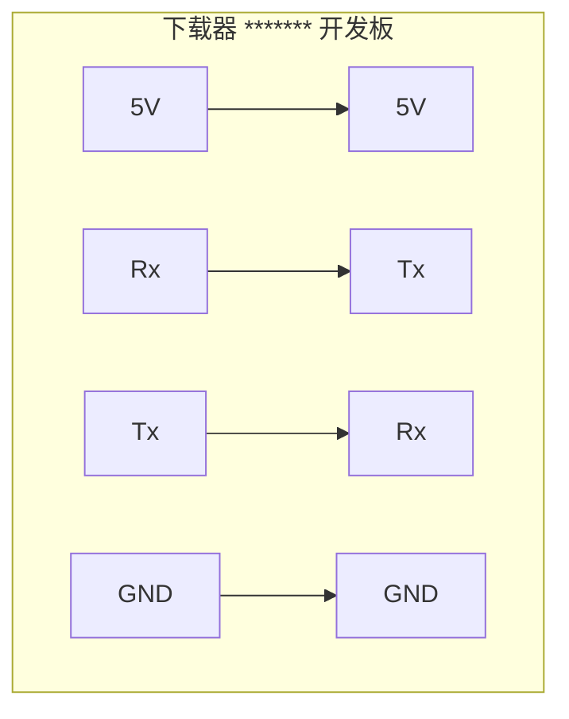

## 不止是萌宠，更是强大的语音+ESP32-S3开发利器！—— 潦草小狗（RY-DOG）

还在为项目添加语音交互而烦恼？想做个酷炫的桌面机器人却被复杂的驱动和电源设计劝退？

潦草小狗（RY-DOG）开发板，一次性解决你的所有痛点！

🚀 【语音交互，张口就来】
内置专业 CI1303 语音芯片与麦克风/喇叭，支持离线语音识别，摆脱网络束缚。更能在线定制专属语音指令与回复，让你的项目“听懂你，回应你”！

🤖 【强劲核心，性能无忧】
搭载强大的 ESP32-S3 模组，提供澎湃算力与 Wi-Fi/蓝牙连接能力，无论是物联网应用还是边缘计算，轻松驾驭。标准开发环境（VSCode/PlatformIO），上手无难度。

🦾 【天生玩家，机器人绝配】
独家板载 8路 SG90 舵机接口！配合内置的高效电源管理（IP5306），稳定输出 5V/2.4A 电流，直接驱动多路舵机，搭建桌面机械臂、仿生机器人从未如此简单！

🔋 【自带电源管理，项目“随身带”】
集成 Type-C 充电、锂电池管理与 5V 升压电路，一块电池即可驱动整个系统（包括舵机！）。告别繁琐的外部电源模块，轻松实现项目便携化、移动化。

💡 【小巧身材，大有可为】
高度集成设计，不仅是一个可爱的语音桌面摆件，更是功能全面的开发平台。预留 OLED 接口、丰富 IO 口，为你的创意提供无限可能。

选择潦草小狗（RY-DOG），你将获得：

一个开箱即用的语音交互平台
一个高性能的 ESP32-S3 开发板
一个集成了多路舵机驱动与电源管理的机器人基板
一个激发无限创意的可爱桌面伙伴
立即拥有潦草小狗，开启你的智能语音与机器人创造之旅！

## 语音固件下载
语音固件采用串口方式进行下载，需配套USB转串口模块，开发板预留下载接口。串口模块与开发板连接方式如下：

官方下载工具使用如下：

## ESP32固件下载
通过板载USB type-C接口进行固件更新，第一次下载可能会出现USB串口识别异常，只需先按住BOOT按键不放，在按一下RST按键，让ESP32进入下载模式即可。
