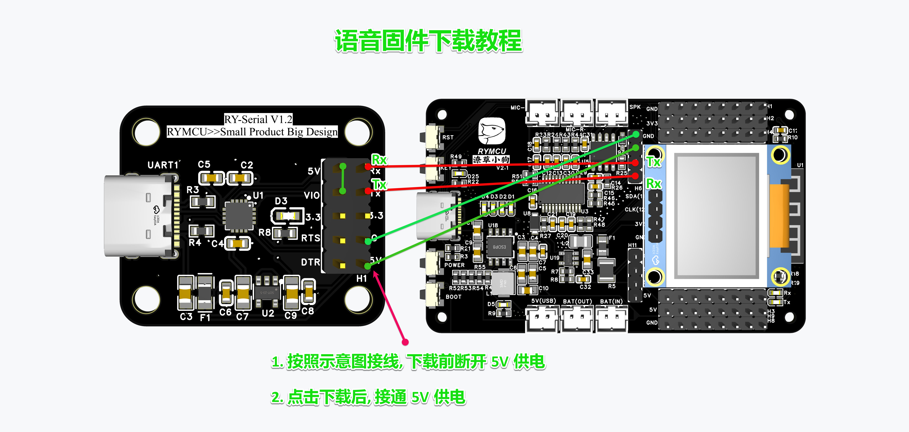
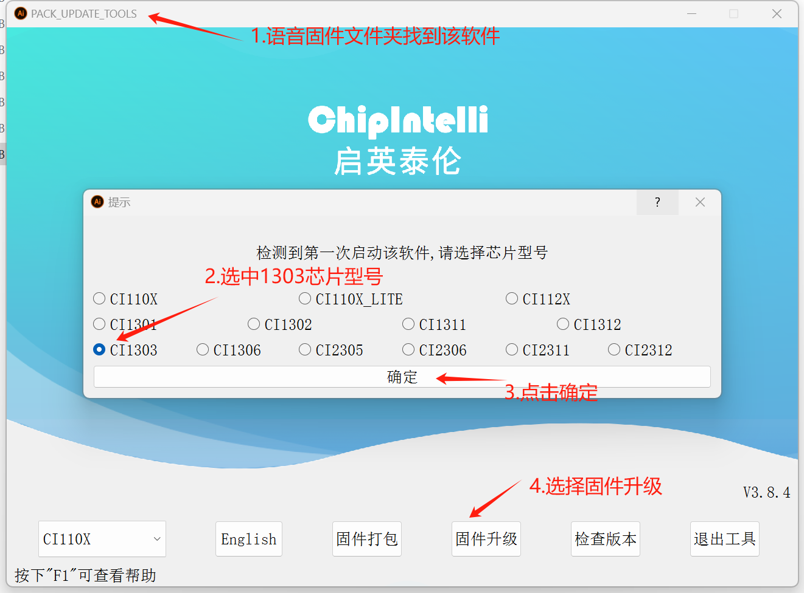
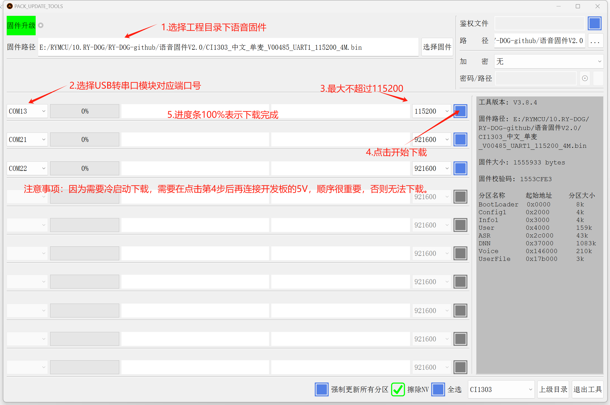

## 潦草小狗（RY-DOG） V2.0
潦草小狗（RY-DOG）为RYMCU社区开发的语音控制桌面小狗摆件模块，同时作为语音及ESP32开发板。板载语音模块CI1303和ESP32-S3模组，两者之间通过串口进行通信。语音模组收到咪头语音指令后转换为相应的串口数据发送给ESP32-S3模组，同时通过喇叭进行播报。ESP32-S3模组接收到相应指令后运行相关程序。因此，需要分别给语音模组和ESP32-S3开发相应的固件。
语音模块CI1303可在启英泰伦官网定制，并生成固件。ESP32-S3固件通过乐鑫官方IDE或者VSCODE+platformIO进行开发。潦草小狗还板载单节3.7锂电池管理模块，采用IP5306方案，可实现最大2.1A充电，可将3.7V锂电池电压升压至5V，最大2.4A放电电流，可用于驱动SG90电机，开发板引出8路SG90电机接口。
## 语音固件下载
语音固件采用串口方式进行下载，需配套USB转串口模块，开发板预留下载接口。串口模块与开发板连接方式如下：

5V---------->5V
Rx---------->Tx
Tx---------->Rx
GND--------->GND

官方下载工具使用如下：

## ESP32固件下载
通过板载USB type-C接口进行固件更新，第一次下载可能会出现USB串口识别异常，只需先按住BOOT按键不放，在按一下RST按键，让ESP32进入下载模式即可。